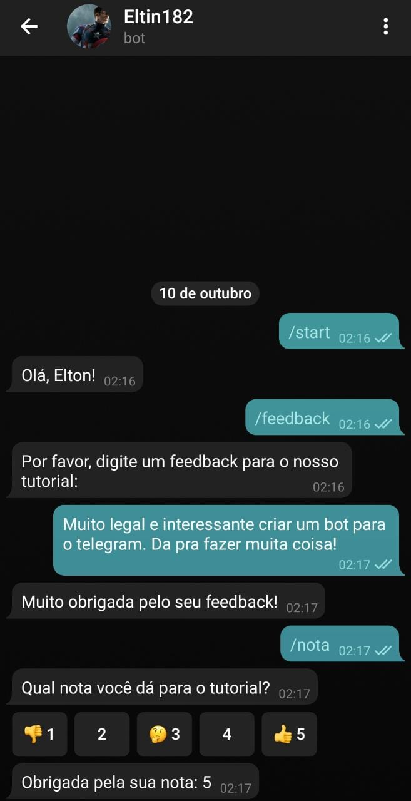

# Eltin182_bot

## :information_source: Simples bot para o telegram

## 👾 Bot

Eltin182_bot é um simples bot que criei com ajuda do curso [Como fazer um Chatbot em 1 dia!](https://www.udemy.com/course/como-fazer-um-chatbot-em-1-dia/) e vou ficar fazendo as coisas nele, testando sua interatividade.

<h3 align="center">
    
</h3>

## :memo: Licença

Este projeto esta sobe a licença MIT. Veja a [LICENÇA][license] para saber mais.

## 👨🏻‍💻 Autor

<h3 align="center">
  
   
  <strong>Elton Santos</strong>
   
   

 

  

 

Feito com ❤️ por Elton Santos 👋🏽 [Entre em contato!](https://www.linkedin.com/in/eltonmelosantos/)

</h3>
